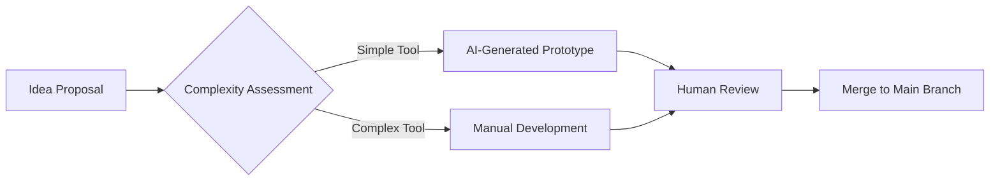

# ToolBox Contribution Guide

[](LICENSE)

Welcome to the ToolBox project! This guide will help you quickly get started with tool development.

## Development Standards

### File Structure
```tree
src/
├── tools/
│   ├── System Tools/       # Subdirectories by category
│   │   └── compress_tool.ts
│   ├── AI Tools/
│   └── Data Tools/
```

### Tool Development Template
```typescript
// src/tools/example_tool.ts
export const schema = {
  name: "demo_tool",
  description: "Description of the example tool",
  // ...complete schema definition
};

export default async function({ params }) {
  // Core logic implementation
  return {
    content: [{ type: "text", text: "Execution result" }]
  };
}

export async function destroy() {
  // Release resources
}
```

## Submission Process

1. **Create a Feature Branch**
   ```bash
   git checkout -b feat/your_tool
   ```

2. **Development and Testing**
   - Write unit tests (refer to test/tools examples)
   - Run the complete test suite:
     ```bash
     npm test
     ```

3. **Submit a PR**
   - Include: Feature description, test results, impact analysis
   - Pass automated security checks (must include a security scan report)

## AI Collaboration Guide

Collaborate with AI using the following commands:
```
/create_tool Request format:
1. Tool Name: verb_noun (English)
2. Function Description: Chinese description
3. Input Parameter Examples
```

## Community Guidelines

- Communication Channel: GitHub Discussions
- Code of Conduct: Adhere to the [Contributor Covenant](CODE_OF_CONDUCT.md)
- Tool Attribution: Developer information will be recorded in the [Hall of Fame](HALL_OF_FAME.md)

## Complete Development Example
Reference: [Tool Development Specifications](prompt.md) and [Existing Tool Implementations](src/tools/)



We look forward to your contributions! 🚀
