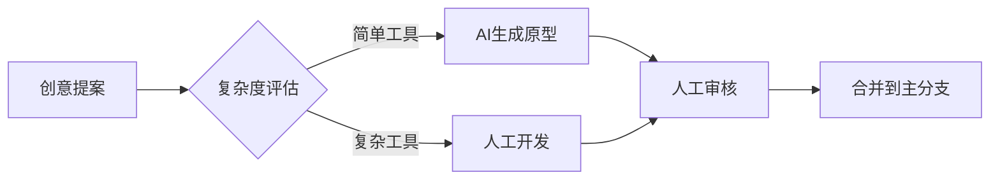

# ToolBox 贡献指南

[](LICENSE)

欢迎参与ToolBox项目！本指南将帮助您快速上手工具开发。

## 开发标准

### 文件结构规范
```tree
src/
├── tools/
│   ├── 系统工具/       # 按分类建立子目录
│   │   └── 压缩工具.ts
│   ├── AI工具/
│   └── 数据工具/
```

### 工具开发模板
```typescript
// src/tools/示例工具.ts
export const schema = {
  name: "demo_tool",
  description: "示例工具描述",
  // ...完整schema定义
};

export default async function({ params }) {
  // 核心逻辑实现
  return {
    content: [{ type: "text", text: "执行结果" }]
  };
}

export async function destroy() {
  // 释放资源
}
```

## 提交流程

1. **创建功能分支**
   ```bash
   git checkout -b feat/your_tool
   ```

2. **开发与测试**
   - 编写单元测试（参考test/tools示例）
   - 执行完整测试套件：
     ```bash
     npm test
     ```

3. **提交PR**
   - 包含：功能描述、测试结果、影响分析
   - 通过自动化安全检查（需包含安全扫描报告）

## AI协作指南

通过以下指令与AI协同开发：
```
/create_tool 请求格式：
1. 工具名称：动词_名词（英文）
2. 功能描述：中文说明
3. 输入参数示例
```

## 社区守则

- 沟通渠道：GitHub Discussions
- 行为准则：遵守[贡献者公约](CODE_OF_CONDUCT.md)
- 工具署名：开发者信息将记录在[荣誉墙](HALL_OF_FAME.md)

## 完整开发示例
参考：[工具开发规范](prompt.md) 和 [现有工具实现](src/tools/)



期待您的贡献！🚀
