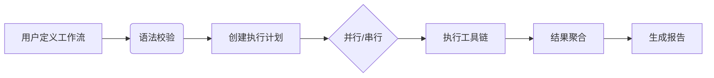
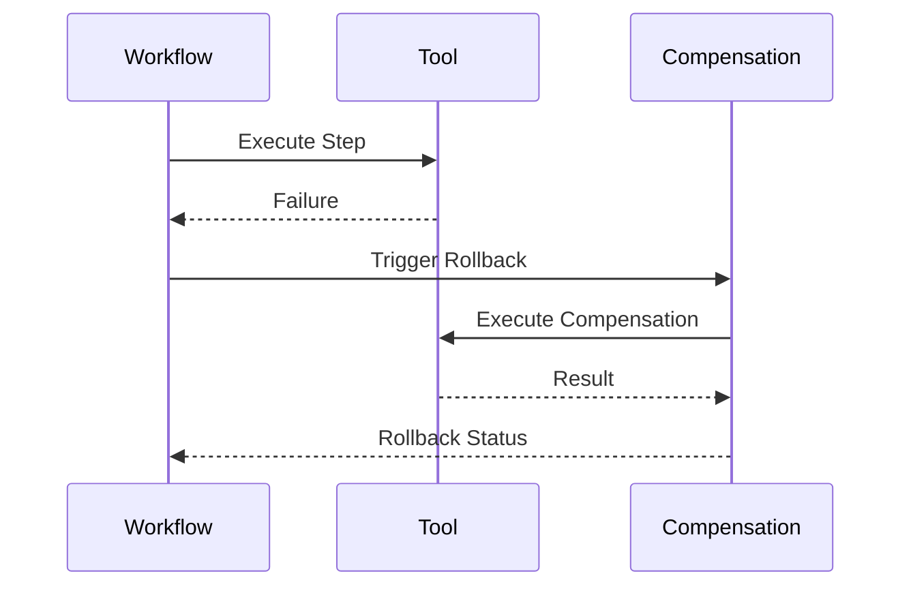

# Workflow 工具开发方案

## 1. 工具概述


## 2. 功能特性
- ✅ 可视化流程定义
- ✅ 智能错误回滚
- ✅ 实时进度监控
- ✅ 跨工具数据传递

## 3. 参数规范（schema）
```typescript
// workflow_tool.ts
export const schema = {
  name: "workflow_tool",
  description: "跨工具工作流编排引擎",
  type: "object",
  properties: {
    version: { type: "string", default: "1.0" },
    steps: {
      type: "array",
      items: {
        type: "object",
        properties: {
          tool: { type: "string" },
          args: { type: "object" },
          retry: { type: "number", default: 0 },
          timeout: { type: "number" },
          compensation: {
            type: "object",
            properties: {
              tool: { type: "string" },
              args: { type: "object" }
            }
          }
        }
      }
    }
  }
};
```

## 4. 核心实现代码
```typescript
// workflow_tool.ts
export default async function(request) {
  const undoStack = [];
  try {
    for (const [index, step] of request.params.arguments.steps.entries()) {
      const result = await executeWithRetry(step, index);
      undoStack.push({ step, result });
    }
    return generateReport('success');
  } catch (error) {
    await performRollback(undoStack);
    return generateReport('failed', error);
  }
}

async function executeWithRetry(step, index) {
  for (let i = 0; i <= step.retry; i++) {
    try {
      return await callToolHandler({
        params: { name: step.tool, arguments: step.args }
      }, `workflow_step_${index}`);
    } catch (error) {
      if (i === step.retry) throw error;
    }
  }
}
```

## 5. 错误处理机制


## 6. 测试方案
| 测试类型 | 案例描述 | 预期结果 |
|---------|---------|---------|
| 正常流程 | 3个成功步骤 | 生成完整报告 |
| 部分失败 | 第2步失败需回滚 | 第1步补偿执行 |
| 压力测试 | 100+步骤链 | 执行时间<10s |
